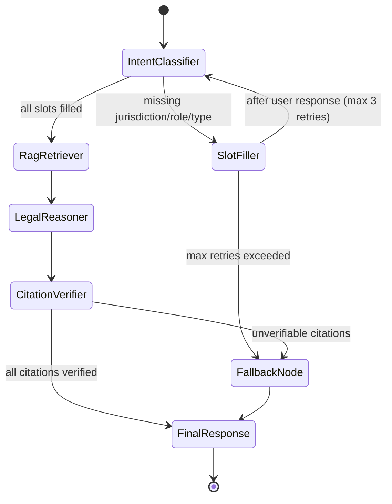

# Agent Workflow: LangGraph Orchestration

## Design Principle: Hybrid Type System

| Boundary | Schema Tool | Why |
|---|---|---|
| **Internal state** (node → node) | `TypedDict` | Lightweight, zero serialization overhead on checkpoint, no runtime tax on trusted code paths |
| **LLM extraction** (Nova Lite → structured output) | Pydantic `BaseModel` | Catch malformed LLM JSON before it poisons state |
| **API input** (API Gateway → Lambda) | Pydantic `BaseModel` | Reject invalid requests before graph entry |
| **Tool contracts** (retriever, calculator, validator) | Pydantic `BaseModel` | Enforce shape of data at untrusted boundaries |

Each system boundary gets Pydantic validation. Each internal hop between trusted nodes uses `TypedDict`. No validation tax on every single node transition — only where data enters from an untrusted source.

---

## 1. LangGraph State Definition

### Internal State (`TypedDict`)

```python
from typing import TypedDict, Optional
from datetime import datetime


class AgentState(TypedDict):
    # Conversation tracking
    messages: list[dict]                   # Human + AI message history
    conversation_context: str              # Condensed summary for multi-turn follow-ups
    session_id: str                        # Unique per-conversation ID (from QueryPayload)

    # Intent & slots
    jurisdiction: Optional[str]            # VIC, NSW, QLD, SA, WA, TAS, ACT, NT, or None
    role: Optional[str]                    # tenant, property_manager, landlord, legal_researcher
    question_type: Optional[str]           # rent_increase, notice_to_vacate, bond_dispute,
                                           # maintenance, lease_renewal, cross_jurisdiction,
                                           # out_of_scope, general
    slots_filled: dict[str, bool]          # Tracks which required slots are populated
    retry_count: int                       # Number of clarification turns (max 3)

    # Retrieval & generation
    entities: dict                         # Extracted dates, amounts, section references
    retrieved_chunks: list[dict]           # Chunks from Qdrant after RRF + BGE reranker
    citation_map: dict[str, str]           # chunk_id → formatted citation for verification
    confidence: Optional[float]            # Reranker confidence score (0.0–1.0)

    # Cross-session memory (Mem0)
    user_id: Optional[str]                 # For Mem0 identity lookup across sessions
    memory_context: dict                   # Mem0 recall result: {preferred_jurisdiction,
                                           #   past_questions, known_role, ...}

    # Output pipeline
    llm_output: Optional[str]              # Raw output from Claude Sonnet (IRAC)
    verified_output: Optional[str]         # Post-citation-verification output
```

### Boundary Schemas (`Pydantic BaseModel`)

These live at system edges and are validated before touching internal state.

```python
from pydantic import BaseModel, Field
from typing import Optional


class QueryPayload(BaseModel):
    """Validates user request at API Gateway boundary."""
    text: str = Field(..., min_length=1, max_length=2000)
    session_id: str = Field(..., min_length=8)
    timestamp: Optional[str] = None


class IntentExtraction(BaseModel):
    """Validates Nova Lite structured output before state injection."""
    jurisdiction: Optional[str] = None
    role: Optional[str] = None
    question_type: Optional[str] = None
    confidence: float = Field(..., ge=0.0, le=1.0)
    entities: dict = Field(default_factory=dict)


class ChunkResult(BaseModel):
    """Validates a single retrieved chunk from Qdrant."""
    chunk_id: str
    text: str
    jurisdiction: str
    act_name: str
    section: str
    subsection: Optional[str] = None
    score: float = Field(..., ge=0.0, le=1.0)


class RetrievalResult(BaseModel):
    """Validates tool output before merging into state."""
    chunks: list[ChunkResult]
    confidence: float = Field(..., ge=0.0, le=1.0)


class DeadlineOutput(BaseModel):
    """Output from the date/deadline calculator tool."""
    deadline_date: str
    days_remaining: int
    section_citation: str
    jurisdiction: str


class RentIncreaseValidation(BaseModel):
    """Output from the rent increase frequency validator."""
    valid: bool
    reason: str
    next_allowed_date: Optional[str] = None
    section_citations: list[str]
```

---

## 2. Node & Edge Topology

### Graph Flow

```
                         ┌─────────────────┐
                         │   User Query    │
                         └────────┬────────┘
                                  │
                                  ▼
                     ┌───────────────────────┐
                     │   IntentClassifier    │
                     │   (Nova Lite)         │
                     │   → jurisdiction      │
                     │   → role              │
                     │   → question_type     │
                     │   → entities          │
                     └───────┬───────────────┘
                             │
              ┌──────────────┼──────────────┐
              │              │              │
              ▼              │              ▼
     ┌─────────────────┐    │    ┌──────────────────┐
     │   SlotFiller    │◀───┘    │  RagRetriever    │
     │   (ask missing) │         │  (Qdrant dense + │
     │   → max 3 turns │         │   BM25 + RRF +   │
     └────────┬────────┘         │   BGE Reranker)  │
              │                  └────────┬─────────┘
              │                           │
              └──────────────┬────────────┘
                             │
                             ▼
                  ┌──────────────────────┐
                  │   LegalReasoner      │
                  │   (Claude Sonnet)    │
                  │   IRAC format        │
                  │   → Issue            │
                  │   → Rule (citations) │
                  │   → Application      │
                  │   → Conclusion       │
                  └──────────┬───────────┘
                             │
                             ▼
                  ┌──────────────────────┐
                  │  CitationVerifier    │
                  │  (rule-based)        │
                  │  → extract citations │
                  │  → cross-check vs.   │
                  │    retrieved chunks  │
                  └──────────┬───────────┘
                             │
              ┌──────────────┼──────────────┐
              │              │              │
              ▼              │              ▼
     ┌─────────────────┐    │    ┌──────────────────┐
     │  FallbackNode   │    │    │  Final Response  │
     │  → uncertainty  │    │    │  (to user)       │
     │  → redirect to  │    │    └──────────────────┘
     │  tenant union   │    │
     └─────────────────┘    │
              │              │
              └──────────────┘
```

### Mermaid (`stateDiagram-v2`)



### Node Descriptions

| Node | Model | Input | Output | Cost/Query | Latency |
|---|---|---|---|---|---|
| **IntentClassifier** | Amazon Nova Lite | Raw query text | Pydantic `IntentExtraction` | ~$0.00002 | ~150ms |
| **SlotFiller** | Nova Lite (prompt) | Missing slot names | Clarifying question text | ~$0.00001 | ~200ms |
| **RagRetriever** | Titan Embed + Qdrant + BGE | Query + jurisdiction filter | Pydantic `RetrievalResult` | ~$0.0001 | ~800ms |
| **LegalReasoner** | Claude Sonnet | Chunks + query + IRAC prompt | IRAC-formatted answer | ~$0.008 | ~1500ms |
| **CitationVerifier** | Rule-based (regex) | LLM output + chunk IDs | Verified or flagged output | $0 | ~50ms |
| **FallbackNode** | Nova Lite (prompt) | Low-confidence signal | Uncertainty message + redirect | ~$0.00001 | ~100ms |

### Conditional Edge Logic

```python
def route_after_classifier(state: AgentState) -> str:
    """Route to SlotFiller if required slots are missing."""
    missing = [
        slot for slot in ["jurisdiction", "role", "question_type"]
        if state.get(slot) is None
    ]
    if missing and state.get("retry_count", 0) < 3:
        return "slot_filler"
    return "rag_retriever"


def route_after_verification(state: AgentState) -> str:
    """Route to FallbackNode if citations can't be verified."""
    if state.get("confidence", 1.0) < 0.6:
        return "fallback"
    return "final"
```

---

## 2B. Error Resilience & Timeout Management

Each node executes within a Lambda invocation with a hard 30s timeout. Per-node budgets prevent a single slow call from starving the rest of the graph.

### Per-Node Timeout Budget

| Node | Budget | Exceeded →
|---|---|---|
| `memory_recall` | 1s | Skip, proceed without memory |
| `intent_classifier` | 2s | Fallback to rule-based classification (keyword match) |
| `slot_filler` | 3s | Assume minimal slots, route to retrieval |
| `rag_retriever` | 3s | Return empty chunks → `confidence: 0.0` |
| `legal_reasoner` | 8s | Degrade output to "Unable to generate full analysis" |
| `citation_verifier` | 2s | Accept LLM output as-is, skip verification |
| `memory_store` | 1s | Silently drop memory persistence |

### Error Handling Per Node

```python
from botocore.exceptions import ClientError, EndpointConnectionError
from qdrant_client.http.exceptions import UnexpectedResponse


def safe_rag_retriever(state: AgentState) -> AgentState:
    """Try Qdrant. On failure, mark low confidence and route to FallbackNode."""
    try:
        chunks = qdrant.search(...)
        state["retrieved_chunks"] = chunks
        state["confidence"] = max(c.score for c in chunks) if chunks else 0.0
    except (UnexpectedResponse, EndpointConnectionError) as e:
        logger.warning(f"Qdrant unavailable: {e}")
        state["retrieved_chunks"] = []
        state["confidence"] = 0.0
        state["error"] = "retrieval_unavailable"
    return state


def safe_legal_reasoner(state: AgentState) -> AgentState:
    """Try Bedrock. On throttle/timeout, degrade to retrieval-summary."""
    import botocore

    # Check remaining Lambda time before attempting LLM call
    if state.get("_remaining_ms", 30000) < 5000:
        state["llm_output"] = "Unable to complete analysis within time budget."
        state["confidence"] = 0.3
        return state

    try:
        response = bedrock_converse_with_backoff(client, model_id, ...)
        state["llm_output"] = response["output"]["message"]["content"][0]["text"]
    except ClientError as e:
        code = e.response["Error"]["Code"]
        if code == "ThrottlingException":
            state["llm_output"] = "Service is currently throttled. Please try again."
        elif code == "ModelTimeoutException":
            state["llm_output"] = "Analysis timed out. Try a more specific question."
        else:
            state["llm_output"] = f"Unexpected error. Try again later."
        state["confidence"] = 0.2
    return state
```

### Degradation Chain

When external services fail, the system degrades gracefully rather than returning a 500:

```
Full IRAC analysis  ──►  Citation-verified output
    │                                │
    ▼                                ▼
Retrieval summary              LLM output accepted
(no IRAC, just facts)          as-is (skip verifier)
    │                                │
    ▼                                ▼
Fallback response              Fallback response
("I couldn't find...")         ("I couldn't find...")
```

### State Error Field

Add to the TypedDict under a new `# Error handling` section:

```python
class AgentState(TypedDict):
    # ... existing fields ...

    # Error handling
    error: Optional[str]              # error_code from failed node (null if OK)
    _remaining_ms: int                # Lambda context.get_remaining_time_in_millis()
```

---

## 3. Tool Inventory

Each tool is defined in two forms: (a) a human-readable signature, (b) a Bedrock Converse API `toolSpec` that enables native Function Calling — the LLM requests tool execution via structured `toolUse` blocks instead of parsing tool calls from raw text.

### Tool A: `rag_retriever`

```
rag_retriever(
    query: str,
    jurisdiction: str,      # Metadata pre-filter value
    question_type: str,     # Hint for query expansion
    top_k: int = 5
) -> RetrievalResult
```

**Bedrock Converse `toolSpec`:**

```json
{
    "toolSpec": {
        "name": "rag_retriever",
        "description": "Search tenancy legislation chunks by jurisdiction. Returns relevant sections with full text, metadata, and confidence scores.",
        "inputSchema": {
            "json": {
                "type": "object",
                "properties": {
                    "query": {
                        "type": "string",
                        "description": "The user's legal question or search terms"
                    },
                    "jurisdiction": {
                        "type": "string",
                        "enum": ["VIC", "NSW", "QLD", "SA", "WA", "TAS", "ACT", "NT"],
                        "description": "Australian state or territory to search"
                    },
                    "question_type": {
                        "type": "string",
                        "enum": ["rent_increase", "notice_to_vacate", "bond_dispute", "maintenance", "lease_renewal", "general"],
                        "description": "Category of legal question for query expansion"
                    },
                    "top_k": {
                        "type": "integer",
                        "default": 5,
                        "description": "Number of top chunks to return"
                    }
                },
                "required": ["query", "jurisdiction"]
            }
        }
    }
}
```

**Flow:**
1. Embed query via Amazon Titan Text Embeddings v2
2. Apply Qdrant `must` filter: `jurisdiction == query.jurisdiction`
3. Run dense search (cosine similarity) + BM25 sparse search in parallel
4. Fuse via RRF (`k=60`), take top-15
5. Cross-encode with BGE-Reranker-v2-m3, take top-5
6. Return `RetrievalResult` (chunks + confidence)

### Tool B: `date_calculator`

```
date_calculator(
    event_date: str,           # e.g. "2026-07-01" (user-provided)
    notice_days: int,          # e.g. 60 (from retrieved section)
    jurisdiction: str,         # Which state's calendar rules
    business_days_only: bool = False
) -> DeadlineOutput
```

**Bedrock Converse `toolSpec`:**

```json
{
    "toolSpec": {
        "name": "date_calculator",
        "description": "Calculate absolute compliance deadlines by adding notice days to an event date. Supports calendar days and business days.",
        "inputSchema": {
            "json": {
                "type": "object",
                "properties": {
                    "event_date": {
                        "type": "string",
                        "description": "Starting date in YYYY-MM-DD format (e.g. when notice was received)"
                    },
                    "notice_days": {
                        "type": "integer",
                        "description": "Number of days required by the relevant section"
                    },
                    "jurisdiction": {
                        "type": "string",
                        "enum": ["VIC", "NSW", "QLD", "SA", "WA", "TAS", "ACT", "NT"],
                        "description": "State for public holiday calendar"
                    },
                    "business_days_only": {
                        "type": "boolean",
                        "default": false,
                        "description": "If true, skip weekends and public holidays"
                    }
                },
                "required": ["event_date", "notice_days", "jurisdiction"]
            }
        }
    }
}
```

**Logic:**
- Parses `event_date` → adds `notice_days` calendar days
- If `business_days_only`: skips weekends and public holidays (via `python-holidays` with state-specific AU datasets)
- Returns `DeadlineOutput` with absolute `deadline_date`, `days_remaining` from today, and the section citation that mandated the duration

### Tool C: `rent_increase_validator`

```
rent_increase_validator(
    jurisdiction: str,
    last_increase_date: str,
    proposed_increase_date: str,
    increase_amount: float,
    current_rent: float,
    property_type: str = "residential"
) -> RentIncreaseValidation
```

**Bedrock Converse `toolSpec`:**

```json
{
    "toolSpec": {
        "name": "rent_increase_validator",
        "description": "Validate whether a proposed rent increase complies with jurisdiction-specific frequency, notice, and amount rules.",
        "inputSchema": {
            "json": {
                "type": "object",
                "properties": {
                    "jurisdiction": {
                        "type": "string",
                        "enum": ["VIC", "NSW", "QLD", "SA", "WA", "TAS", "ACT", "NT"],
                        "description": "State whose rules apply"
                    },
                    "last_increase_date": {
                        "type": "string",
                        "description": "Date of last rent increase in YYYY-MM-DD"
                    },
                    "proposed_increase_date": {
                        "type": "string",
                        "description": "Proposed new rent effective date in YYYY-MM-DD"
                    },
                    "increase_amount": {
                        "type": "number",
                        "description": "Dollar amount of the proposed increase"
                    },
                    "current_rent": {
                        "type": "number",
                        "description": "Current rent amount before increase"
                    },
                    "property_type": {
                        "type": "string",
                        "enum": ["residential", "rooming_house", "caravan_park"],
                        "default": "residential",
                        "description": "Type of rental property"
                    }
                },
                "required": ["jurisdiction", "last_increase_date", "proposed_increase_date", "increase_amount", "current_rent"]
            }
        }
    }
}
```

**Logic:**
- Looks up jurisdiction-specific rules (frequency, notice period, amount cap if applicable):
  - VIC: 12 months, 60 days' notice, no cap (but must not exceed market)
  - NSW: 12 months, 60 days' notice, no cap
  - QLD: 12 months, 2 months' notice, once per 12 months
- Validates: (a) frequency compliance, (b) notice period, (c) if amount triggers tribunal review
- Returns `RentIncreaseValidation` with specific section citations for each violated rule

### Function Calling Integration in LegalReasoner

The `legal_reasoner_node` uses Bedrock Converse API's native `toolConfig` to bind all three tools. This replaces raw prompt-based tool invocation:

```python
import boto3

bedrock = boto3.client("bedrock-runtime", region_name="ap-southeast-2")

TOOL_CONFIG = {
    "tools": [
        rag_retriever_tool_spec,    # toolSpec dicts from above
        date_calculator_tool_spec,
        rent_increase_validator_tool_spec,
    ],
    "toolChoice": {"auto": {}},  # LLM decides which tool to call
}

def legal_reasoner_node(state: AgentState) -> AgentState:
    messages = build_converse_messages(state)
    system_prompt = [{"text": IRAC_SYSTEM_PROMPT}]

    # Initial call: LLM may return toolUse blocks
    response = bedrock.converse(
        modelId="anthropic.claude-sonnet-4-20250528",
        system=system_prompt,
        messages=messages,
        toolConfig=TOOL_CONFIG,
    )

    # Handle toolUse blocks (LLM requested tool execution)
    for content in response["output"]["message"]["content"]:
        if "toolUse" in content:
            tool_name = content["toolUse"]["name"]
            tool_args = content["toolUse"]["input"]
            result = execute_tool(tool_name, tool_args)  # runs the Python function
            messages.append({
                "role": "user",
                "content": [{
                    "toolResult": {
                        "toolUseId": content["toolUse"]["toolUseId"],
                        "content": [{"json": result.model_dump()}],
                    }
                }],
            })

    # Follow-up call with tool results appended
    if has_tool_use(response):
        response = bedrock.converse(
            modelId="anthropic.claude-sonnet-4-20250528",
            system=system_prompt,
            messages=messages,
            toolConfig=TOOL_CONFIG,
        )

    state["llm_output"] = response["output"]["message"]["content"][0]["text"]
    return state
```

**Why Function Calling over raw prompt:**
- **Deterministic tool binding** — tool schemas are typed JSON, not parsed from free text
- **Multi-turn tool loop** — Bedrock handles the `toolUse` → `toolResult` cycle natively
- **Cost neutral** — tool definitions add ~100 tokens to the system prompt, negligible at 2K input

---

## Graph Construction (LangGraph v0.3+)

```python
from langgraph.graph import StateGraph, END

workflow = StateGraph(AgentState)

# Add nodes
workflow.add_node("intent_classifier", intent_classifier_node)
workflow.add_node("slot_filler", slot_filler_node)
workflow.add_node("rag_retriever", rag_retriever_node)
workflow.add_node("legal_reasoner", legal_reasoner_node)
workflow.add_node("citation_verifier", citation_verifier_node)
workflow.add_node("fallback", fallback_node)

# Set entry point
workflow.set_entry_point("intent_classifier")

# Add edges
workflow.add_conditional_edges(
    "intent_classifier",
    route_after_classifier,
    {"slot_filler": "slot_filler", "rag_retriever": "rag_retriever"}
)
workflow.add_edge("slot_filler", "intent_classifier")
workflow.add_edge("rag_retriever", "legal_reasoner")
workflow.add_edge("legal_reasoner", "citation_verifier")
workflow.add_conditional_edges(
    "citation_verifier",
    route_after_verification,
    {"fallback": "fallback", "final": END}
)
workflow.add_edge("fallback", END)

app = workflow.compile()


# --- MCP Integration (started on Lambda) ---
from mcp.server.fastmcp import FastMCP

mcp = FastMCP("tenancy-agent", port=8000)


@mcp.tool()
def rag_retriever(query: str, jurisdiction: str, question_type: str = "general",
                  top_k: int = 5) -> RetrievalResult:
    \"\"\"Search tenancy legislation chunks by jurisdiction.\"\"\"
    return _execute_rag_retriever(query, jurisdiction, question_type, top_k)


@mcp.tool()
def date_calculator(event_date: str, notice_days: int, jurisdiction: str,
                    business_days_only: bool = False) -> DeadlineOutput:
    \"\"\"Calculate absolute compliance deadlines.\"\"\"
    return _execute_date_calculator(event_date, notice_days, jurisdiction, business_days_only)


@mcp.tool()
def rent_increase_validator(jurisdiction: str, last_increase_date: str,
                            proposed_increase_date: str, increase_amount: float,
                            current_rent: float,
                            property_type: str = "residential") -> RentIncreaseValidation:
    \"\"\"Validate rent increase against jurisdiction rules.\"\"\"
    return _execute_rent_validator(jurisdiction, last_increase_date,
                                    proposed_increase_date, increase_amount,
                                    current_rent, property_type)


mcp.run(transport="sse")  # or "stdio" for local dev
```

---

## 4. MCP Server Integration

All three tools are exposed as a **Model Context Protocol (MCP) server**, making the agent SDK-agnostic. Any MCP host (Claude Desktop, VS Code, Cursor, custom client) can discover and invoke these tools without knowing the Lambda transport.

### Protocol Architecture

```
┌──────────────────┐     stdio/SSE     ┌───────────────────────────────┐
│  MCP Host        │◀────────────────▶│  MCP Server (Python)          │
│  (Claude Desktop │                   │  ┌─────────────────────────┐  │
│   VS Code        │                   │  │ tools/list →            │  │
│   Cursor         │                   │  │   rag_retriever         │  │
│   Custom Client) │                   │  │   date_calculator       │  │
└──────────────────┘                   │  │   rent_increase_validator│  │
                                       │  └─────────────────────────┘  │
                                       │                               │
                                       │  Lambda handler wraps MCP     │
                                       │  for production deployment    │
                                       └───────────────────────────────┘
```

### MCP Protocol Details

| Operation | Description |
|---|---|
| `tools/list` | Returns the 3 tool schemas (identical to Bedrock `toolSpec` above) |
| `tools/call` | Executes a tool with given arguments, returns typed result |
| `resources/subscribe` | Optional: expose legislation chunk IDs as subscribable resources |
| `initialize` | Protocol handshake with version negotiation |

### Deployment Modes

**Local development** (stdio transport):
```json
// ~/.config/Claude/claude_desktop_config.json
{
  "mcpServers": {
    "tenancy-agent": {
      "command": "python",
      "args": ["src/mcp_server.py"]
    }
  }
}
```

**Production** (SSE transport via Lambda):
- MCP server runs inside the same Lambda as the LangGraph supervisor
- API Gateway routes `POST /mcp` to Lambda, which delegates to the MCP router
- SSE transport enables long-lived connections for multi-turn tool conversations

### Why MCP (Portfolio Value)

- **SDK independence** — the agent's reasoning can be swapped between LangGraph, Claude SDK, or a custom loop without rewriting tool integrations
- **Demo flexibility** — one `claude_desktop_config.json` change and the full agent runs from Claude Desktop, no frontend needed
- **Production pattern** — MCP is the emerging standard for AI tool connectivity (OpenAI, Anthropic, Google all adopting it)

---

## 5. Cross-Session Memory with Mem0

The agent uses **Mem0** to persist user preferences across sessions, reducing slot-filler turns and personalizing responses for returning users.

### Memory Architecture

```
Session 1                          Session 2
┌─────────────┐                    ┌─────────────┐
│ User: "I'm  │                    │ User: "What │
│ in VIC"     │                    │ about bond  │
│       │     │                    │ timelines?" │
└───────┬─────┘                    └──────┬──────┘
        │                                 │
        ▼                                 ▼
┌──────────────────┐             ┌──────────────────┐
│ SlotFiller       │             │ Mem0 Search      │
│ → learns: VIC    │             │ → recalls: VIC   │
│ → tenant         │             │ → pre-fills slot │
└────────┬─────────┘             └────────┬─────────┘
         │                                 │
         ▼                                 ▼
┌──────────────────┐             ┌──────────────────┐
│ Mem0 Store       │             │ SlotFiller       │
│ → user_id: abc   │             │ SKIPPED          │
│ → jurisdiction:  │             │ (slot already    │
│   VIC            │             │  filled from     │
│ → role: tenant   │             │  memory)         │
└──────────────────┘             └──────────────────┘
```

### Integration Points

```python
from mem0 import MemoryClient

# Initialize (API key from env)
mem0 = MemoryClient(api_key=os.environ["MEM0_API_KEY"])


class AgentState(TypedDict):
    # ... existing fields ...
    user_id: Optional[str]
    memory_context: dict


def memory_recall(state: AgentState) -> AgentState:
    """Called at graph entry. Pre-fills slots from cross-session memory."""
    if not state.get("user_id"):
        return state

    memories = mem0.search(
        query="user preferences",
        user_id=state["user_id"],
        limit=5,
    )

    state["memory_context"] = {
        m["memory_id"]: json.loads(m["text"])
        for m in memories
    }

    # Pre-fill slots if memory has learned preferences
    for memory in memories:
        data = json.loads(memory["text"])
        if data.get("jurisdiction") and not state.get("jurisdiction"):
            state["jurisdiction"] = data["jurisdiction"]
        if data.get("role") and not state.get("role"):
            state["role"] = data["role"]

    return state


def memory_store(state: AgentState) -> AgentState:
    """Called after SlotFiller succeeds. Persists learned slots."""
    if not state.get("user_id"):
        return state

    learned = {
        "jurisdiction": state.get("jurisdiction"),
        "role": state.get("role"),
        "question_type": state.get("question_type"),
        "last_updated": datetime.utcnow().isoformat(),
    }

    # Remove None values before storage
    learned = {k: v for k, v in learned.items() if v is not None}

    mem0.add(
        json.dumps(learned),
        user_id=state["user_id"],
        metadata={"source": "slot_filler", "session_id": state.get("session_id")},
    )

    return state


def memory_log_failure(state: AgentState) -> AgentState:
    """Called from FallbackNode. Logs unresolved queries for later review."""
    if not state.get("user_id"):
        return state

    mem0.add(
        json.dumps({
            "unresolved_query": state.get("messages", [{}])[-1].get("content", ""),
            "timestamp": datetime.utcnow().isoformat(),
            "confidence": state.get("confidence"),
        }),
        user_id=state["user_id"],
        metadata={"source": "fallback", "type": "unresolved"},
    )

    return state
```

### Graph Integration

```python
# Add memory nodes between existing nodes
workflow.add_node("memory_recall", memory_recall)
workflow.add_node("memory_store", memory_store)

# memory_recall runs BEFORE intent_classifier
workflow.add_edge("memory_recall", "intent_classifier")
workflow.set_entry_point("memory_recall")  # was "intent_classifier"

# memory_store runs AFTER slot_filler succeeds
workflow.add_edge("slot_filler", "memory_store")
workflow.add_edge("memory_store", "intent_classifier")  # was direct edge
```

### Cost Impact

| Component | Cost | Notes |
|---|---|---|
| Mem0 Free Tier | $0 | 1K memories, 100K search tokens/month |
| Per search call | ~$0.00005 | Negligible at 50 queries/day |
| Per store call | ~$0.00003 | Only on slot-filler success |
| **Total added** | **~$5-10/mo** | Still under $20/mo ceiling |

### Expected Benefit

For returning users (who have session history), Mem0 eliminates 1-2 slot-filler turns per query, reducing average latency by ~200-400ms and improving the experience of "the system already knows me."
